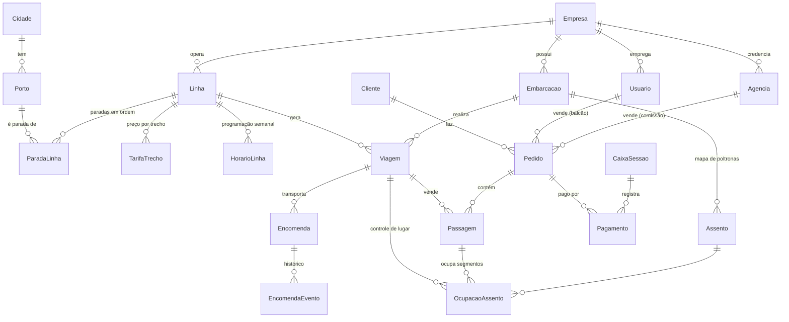

# Banco de dados

Fonte da verdade: [`prisma/schema.prisma`](../prisma/schema.prisma). PostgreSQL, datas em UTC, exibição em `America/Manaus`.



## Grupos de tabelas

| Grupo | Tabelas | Para que serve |
|---|---|---|
| Empresa e acesso | `Empresa`, `Usuario`, `UsuarioLinha`, `Agencia` | Dados fiscais, perfis de acesso, vendedores restritos a linhas, agências com % de comissão |
| Geografia | `Cidade`, `Porto` | Municípios atendidos e portos, cada um com sua taxa de embarque |
| Frota | `Embarcacao`, `Assento` | Cada lancha com seu mapa (fileira/coluna, tipo janela/preferencial) |
| Rotas | `Linha`, `ParadaLinha`, `TarifaTrecho`, `HorarioLinha` | Sequência de paradas, preço de cada par origem→destino, dias/horários de saída |
| Viagens | `Viagem` | Uma saída concreta (linha + embarcação + data/hora + status) |
| Vendas | `Cliente`, `Pedido`, `Passagem`, `OcupacaoAssento`, `Pagamento`, `CaixaSessao` | Carrinho → pagamento → bilhete; controle de lugar; caixa do balcão |
| Encomendas | `Encomenda`, `EncomendaEvento` | Carga com remetente/destinatário, frete e linha do tempo do rastreio |

## Como a venda por trecho evita duplicidade

Segmento *N* = trecho entre a parada *N* e a *N+1*. Ao vender Manaus(0)→Parintins(2) na poltrona 12A:

```
OcupacaoAssento (viagem, 12A, 0)
OcupacaoAssento (viagem, 12A, 1)
```

A chave primária `(viagemId, assentoId, segmento)` faz o próprio banco recusar uma segunda venda que se
sobreponha. Uma venda Parintins(2)→Santarém(5) na mesma poltrona usa os segmentos 2, 3 e 4 e é aceita.
Quando o pedido expira ou é cancelado, a aplicação marca a passagem como `CANCELADA` e apaga as linhas de
ocupação dela, liberando a poltrona.

## Campos preparados para o futuro

- `Passagem.bpeChave` / `bpeProtocolo`: retorno da SEFAZ ao emitir o BP-e.
- `Pagamento.gateway` / `gatewayId` / `pixCopiaCola`: integração com o gateway (webhook localiza o pagamento pelo `gatewayId`).
- `Cidade.timezone`: Santarém/PA usa `America/Santarem` (UTC−3), diferente de Manaus (UTC−4).
- `Empresa`: já existe como tabela. Se um dia virar marketplace com outras empresas, basta ligar `Linha`/`Embarcacao` a empresas diferentes.
